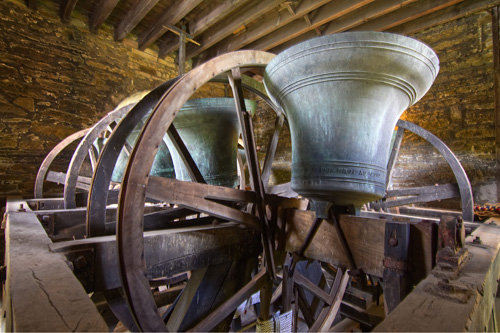

# Belfry Upkeep

Welcome to *Belfry Upkeep*. This online document, produced by the Central Council Stewardship & Management Workgroup, is aimed at the Steeple Keeper -- the one responsible for keeping the bells in order. You may be an established Steeple Keeper, or one just new to the job, or someone wondering if you should take it on.

Our aims in this document are:

- To help you understand the installation in your tower (they are all different, in detail at least)
- To describe the checks you should carry out to identify any problems
- To advise you on the maintenance tasks that you should be able to carry out, possibly with expert advice or assistance
- Most importantly, to help you recognise the tasks that require specialist knowledge from a bell hanger or other expert

## Latest changes

| Date | Changes |
| ---- | ---- |
| 14/03/2022 | Added pre-publication of Bearings |
| 12/03/2022 | Added pre-publication version of Wheels |
| 11/03/2022 | Added pre-publication versions of: Home Page, Introduction, Faculty Jurisdiction Rules, H&S and Clappers, plus temporary links to Maintenance Schedule and Fault Finding |

## Image Credits

Credits will be found at the end of each chapter. The picture on this page shows the six bells of St Thomas the Martyr, Up Holland, Lancashire, UK raised ready for ringing. This was the winner of the *Bells and Installations* round of the Central Council photographic competition. (Photo: Phil Pope)

## Acknowledgements
**For technical advice**: Bryn-Marie Reinstadler and Graham John.

**For words, pictures, reviews, comments and general assistance**: John Beresford, Marcus Booth, Will Bosworth, Keith Brown, Graham Clifton, Tony Crabtree, Alan Frost, Alan Moult, Alison Hodge, John Payton, Chris Povey, Philip Pratt, David Roskelly, Robin Shipp, Aveline Perez de Vera, Peter Woollam. 

-----

Version 0.1 (pre-publication), March 2022

© 2022 Central Council of Church Bell Ringers