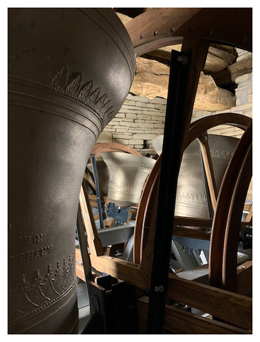

# Introduction

Details of a bell installation are out of sight and out of mind for a surprising number of ringers but will soon be obvious if their upkeep is neglected. At the least, the bells may become progressively more difficult to handle, leading to poor striking, discouraging ringers and frightening away learners. At worst, it could result in expensive damage to the installation.

This online document is addressed primarily at **Steeple Keepers**, who are responsible for carrying out the activities described here. Their role, appointment and experience levels are described here. We also provide a guide to finding your way around the whole document.

## The Steeple Keeper


There are many different sorts of bell installations and many different types of Steeple Keeper. We will need to generalise: please use common sense where necessary to refer our words to your own case.


### Role

A Steeple Keeper (there may be alternative names) is someone who has been [appointed](#appointment) to maintain a bell installation in a safe and effective working condition. This will involve regular checks and responding to incidents, carrying out maintenance within the level of their [experience](#experience-levels), and referring problems to specialists (usually Bell Hangers) where necessary.

### Appointment

With very few exceptions, the bell ringers do not own the bells. There will usually be what we will term an **Authorising Body** that will have a legal responsibility for the tower and its contents. Within the Church of England this role is filled by the Churchwardens and the Parochial Church Council (PCC). Requirements in other jurisdictions are covered in [Formal Requirements](/docs/020-permissions/).

The Steeple Keeper must be formally appointed by the Authorising Body in a clear, democratic and traceable way. One example would be a decision recorded in the minutes of a PCC meeting. Once appointed, the Steeple Keeper must maintain contact with the Appointed Body. While this applies to all ringers, it is particularly important for the Steeple Keeper because the operation and needs of a bell installation may not be familiar to the average member of an Authorising Body.

### Experience levels

This document is NOT intended to provide a qualification system for Steeple Keepers. Rather, we adopt the descriptive terms defined below in **bold**:

-  A **Novice Steeple Keeper** is one learning the task. We hope this document will be helpful, but the main instruction will come from local experts, both in formal courses and one-to-one practical demonstrations, supported by wider reading and other information, often backed by technical and engineering knowledge and experience.
-  A **Typical Steeple Keeper** will have carried out all the routine tasks relevant to their own tower under supervision and will then be capable of carrying them out without supervision; most importantly, they will be capable of recognising cases where they do need to seek guidance. Most Steeple Keepers will fall into this category.
-  An **Experienced Steeple Keeper** will have experience of a wide range of installations and their potential problems (although they will never make the mistake of thinking they know it all). They will play a role in the task of aiding others in the transition from **Novice** to **Typical Steeple Keeper**.

In some cases, we will identify tasks which must be carried out by a **Specialist**, often a **Bell Hanger**. The fittings and materials of a bell installation may not be familiar to a standard engineering contractor and care must be taken in selecting any other than a specialist Bell Hanger.


In this document, we are using the term ‘**Bell Hanger**’, be they an individual or a company, as having experience in bell installations and meeting the regulatory and insurance requirements to carry out this work.


## Finding Your Way Round this Document

Links to chapters are in the left-hand side navigation bar and links to sections within each chapter are in the right-hand navigation bar. If you are using a small screen you may need to click on the menu bars (three stacked horizontal lines) in the top left or right to access the menus.

Within the text, links to sections within the current chapter, to other chapters, and to external web references are shown in blue. Links shown in ***bold italic*** refer to entries in the 'Glossary' chapter.

Each chapter covers a major component part of a bell installation. The following points should be noted: 

-  These are not intended as a complete historical description of the component. They provide enough background for the reader to recognise which of the many types of installation they may encounter and the problems which may occur. 
-  The basic checks which need to be carried out are described.
-  The maintenance which a Typical Steeple Keeper can carry out is described, and activities that must be referred to a Specialist (usually a professional Bell Hanger) are clearly identified. 


Some chapters are common to all activities. Please read them: they are important and some have legal implications. These are:
-  [Formal Requirements](/docs/020-permissions/) covers the need for ringers to recognise the authority responsible for the tower and its fittings, and the need to establish a good working relationship with them. Relevant regulations are described and outline descriptions are given of differences in jurisdictions other than the Church of England.
-  [Faculty Jurisdiction Rules](/docs/030-faculty-rules/) covers the legally based rules which apply within Church of England jurisdiction, with specific guidance on those most relevant to ringers.
-  [Health & Safety](/docs/040-health-and-safety/) provides guidance on the practical application of Health & Safety principles within the bell chamber.


## If You Are Just Starting Out

It may be that you have just ‘inherited’ a new tower – perhaps one where there has been no checking or maintenance for a number of years. Where do you start? For either a Novice or a Typical Steeple, we strongly recommend that you initiate a full inspection by an expert – ideally a Bell Hanger. This will provide a baseline for drawing up a schedule for your own regular checking and maintenance (see [Maintenance Schedule](/docs/150-maintenance-schedule/)).

## Image Credits

| Figure | Details | 
| :---: | --- | 
| Title Picture | Hawkesbury, Gloucestershire, new ring of 8 bells, cast by Allanconi in Italy, 2020, installed by Matthew Higby. (Photo: Robin Shipp) |

----

Version 0.1 (pre-publication), March 2022

© 2022 Central Council of Church Bell Ringers

