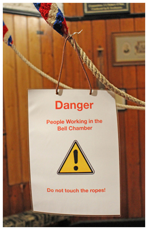
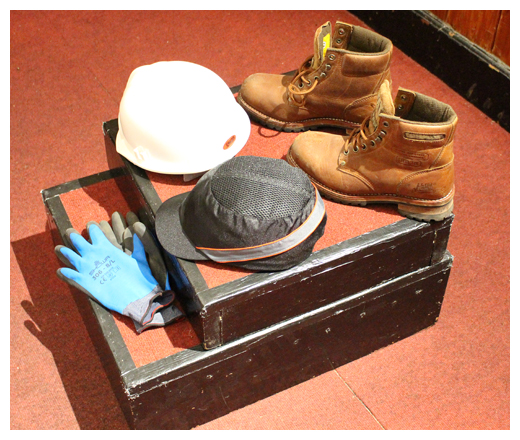
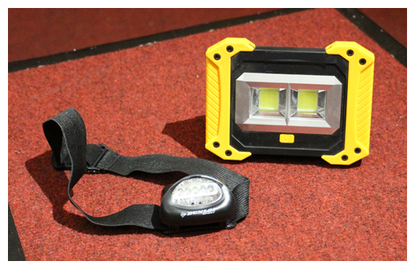

# Health & Safety

Consideration of Health & Safety (H&S) is important for all activities within a tower. This chapter covers the specific aspects of H&S when carrying out routine checks and basic maintenance in the bell chamber, in any tower. 


Note that there will be an Authorising Body for work carried out in a tower. Within the Church of England this will be the Church Wardens and the Parochial Church Council; different arrangements may apply in other jurisdictions – see [Formal Requirements](/docs/020-permissions/). Members of this body may not be familiar with aspects of working on bell installations and the ringers must explain and agree their methods of working. Note that this does not detract from the ringers’ own responsibility for safe working.


There is a range of legal requirements must be followed and guidance from the UK Health & Safety Executive is available [here](https://www.hse.gov.uk/pubns/hsc13.pdf). While many of these requirements are written as if only for those in employment, most also apply to volunteers. We identify here general rules intended to help identify potential hazards and to reduce risks to those involved. We recognise that an appropriate balance must be achieved between making the activity achievable while reducing the level of risk to that which is as low as reasonably possible. 

## Topics Relevant to Work in the Bell Chamber

### Protecting workers in the bell chamber

Accidental or malicious interference with the bell ropes may present a hazard when work is being carried out in the bell chamber. The extent of risk depends on the accessibility of the ringing room – this is a particular problem for ground-floor rings. Possible solutions are:

- Making sure that someone is present in the ringing room. This may not be possible unless routine checks and maintenance are being carried out on the same day as general tower housekeeping.
- Your expected time of completion is known by others and that they check that you return on schedule.
- Warning notices – an example is shown in the Title Figure (but do not rely on this alone). 
- Hoisting the ropes on a spider. For ground-floor or otherwise accessible ringing rooms this may require a locking system for the spider.
- Hoisting the ropes up into a secure intermediate room, or even into the bell chamber.
- Consider security of the building while working upstairs – an open church and tower would enable unauthorised access and could pose risks to those working upstairs. A secured building could prevent access by help in an emergency. Could people upstairs be locked in accidentally by a well-meaning person who was unaware? Arrangements will have to be considered for the building in question: other users, access routes, key holders etc.  

### Working conditions

Bell chambers present significant hazards when moving around. The following points should be noted: 

- Where possible, maintain three points of contact when making a move.
- Test any footholds before applying weight.
- Beware of damaged or rotten floorboards.
- Do not try to carry large and / or heavy items:
   - Pull bags of tools, etc, up by rope rather than carrying them up ladders.
   - Where possible, have assistants to pass items safely.
- Remember that bells, wheels and ropes will move if force is applied.
- Be aware of heavy weights. For example, be prepared to take a significant weight if you are supporting a clapper which is about to be removed.
- Some people may wish to bring a radio or listen to music or other media while working in a tower. This is not recommended (whether with headphones or stand-alone equipment) as people should be able to communicate with each other clearly, particularly if an emergency should arise.

### Ladders and working at heights

Very few towers were constructed with the working platforms, ladders and guard rails that would be built into a newly designed and constructed building. Not all tower staircases even have handrails. Anyone working in a tower must therefore consider how they will access and manoeuvre in and around the bell frame and installation. Remember that some timber - whether ladders, flooring, or other planks and boarding - may be rotten or decayed so not strong enough to take the weight of one or more people perhaps also with the additional weight of heavy items such as a clapper. 

### Hazardous materials

Where chemicals are used, the container must be checked for health warnings. For example, white spirit has traditionally been used for cleaning oil and grease spills. But white spirit is harmful to skin and the lungs, and is difficult to dispose of safely. Fortunately, safer materials with low volatile organic compounds (VOC) are now available and should be used instead.

If any repainting involves removal of old paint, be aware that this may contain lead. Get advice from an expert.

After work is complete, any paints, chemicals and cleaning products, as well as brushes and rags used to apply them, must be removed from the tower. They should be stored if likely to be reused in appropriate clean dry conditions according to the manufacturers’ instructions, with empty containers and rubbish disposed of safely.

Bird or bat droppings can carry infections such as ***[psittacosis](/docs/170-glossary/#psittacosis)*** from birds. If extensive, a specialist should be employed for cleaning.

Although less likely in a church tower, there may be old asbestos boarding or lagging in towers. As a hint, if plumbing is or has been installed - for example water tanks and pipework - this may well have been lagged with materials that are now recognised as hazardous. 

### Personal protective equipment

Suitable personal protective equipment should be worn when working in the bell chamber:

- A boiler suit or, more often nowadays, reinforced workwear.
- Non-slip safety boots, with steel toecaps and good ankle support.
- Protective gloves suitable for the task undertaken.
- Face mask and eye protection, especially for when sanding or creating dust, cleaning up dust and debris, or drilling above head height.
- If work is being carried out at various levels, a hard hat should be worn to protect against falling objects; for working under bells a bump cap may be preferable (although this will not protect against falling objects).

Examples of gloves, hard hat and bump cap, and safety boots are shown in Figure 1.

*Figure 1: Typical personal protective equipment*

### Fire protection

Naked flames and other heat sources should never be used in a tower; smoking is forbidden! Also remember that, when cutting or drilling, swarf and the hole being created may become hot. Swarf may even be hot enough to start a fire if it builds up in contact with other flammable substances.

### Working alone

In general, you should NOT work alone in a bell chamber. The only possible relaxation is if someone else is in the tower and in contact with you: the most likely case is when you are fitting a new rope and the helper is in the ringing room holding the bottom end at the correct height.

Bell chambers offer many opportunities for slips, trips and falls. If one of those led to injury when working alone, how would you summon help? You might have a mobile phone – but that could be damaged or you might be unconscious. Will there even be a reliable signal and do you know who to call in an emergency? You might have told someone what you were doing – but how long would it take them to realise what had happened?

### Moving bells

It may be necessary to swing a bell through a small angle – for example, to listen for noise in the bearings. Remember that it is difficult, even impossible, to stop a moving bell. So be very careful where you place head, hands and feet when a bell is moving, even by a small amount. Make sure that co-workers are aware when a bell is to be moved by someone else. 

### Can you work on bells when ‘up’?

In general, you should **NOT** carry out work in the bell chamber when any bell is ‘up’. Even moving past an ‘up’ bell to reach one that is ‘down’ may pose unacceptable risks. 

The only likely relaxation is where it is necessary to observe a bell while a second person is ringing it – to check for rope handling problems, for example, or to check if a newly fitted Hastings stay is binding on the quadrant. Based on a risk assessment, the observer **MUST** position themself out of any danger (including consideration of the possibility of ejection of a broken clapper) and **MUST** wear ear protection. Most importantly, the observer **MUST** be able to contact the ringer immediately in case of any problem. Ideally another person should be present in the bell chamber, again well out of the way of danger.

### Lighting and electrical equipment

A good starting point is for the bell chamber to be well lit with professionally installed lighting. But that is not always available and, in any case, additional lighting may be needed: for example, when working under the bells. In the past, this usually required inspection lamps with trailing mains cables. But the availability of bright, portable, battery powered LED lights removes the risks of tripping and electrocution posed by mains lighting. An LED head torch is invaluable, especially when working in cramped conditions. Examples of an LED head torch and portable light are shown in Figure 2.

*Figure 2: Examples of portable LED lights*

If there is no natural lighting in the bell chamber, then more than one light source should be always on. It is very easy to break a lamp or for batteries to fail, leaving those in the bell chamber in complete darkness. Remember that it may get dark while you are working in the tower later in the afternoon or evening! 

A general rule is that mains power tools with trailing leads should be avoided in the ringing chamber. If it is essential, a risk assessment must be carried out and great care exercised to make sure that the cables do not get damaged or add yet more trip hazards. Remember that portable battery power tools are available for almost all tasks likely to be carried out by a Typical Steeple Keeper.

### Used of closed-circuit TV

Some churches have installed closed-circuit TV systems allowing a choice of views of (a) the interior of the church (checking for progress of a wedding) and (b) the bell chamber (useful for open day visits). The latter can also be useful in maintaining contact between the ringing room and the bell chamber during maintenance work.

## Image Credits

| Figure | Details | 
| :---: | --- | 
| Title Picture | Typical warning notice. (Photo: Robin Shipp) |
| 1 | Examples of typical protective wear: gloves, hard hat, bump cap, safety boots. (Photo: Robin Shipp) |
| 2 | Examples of LED lighting: head torch, portable light. (Photo: Robin Shipp) |

----

Version 0.1 (pre-publication), March 2022

© 2022 Central Council of Church Bell Ringers

