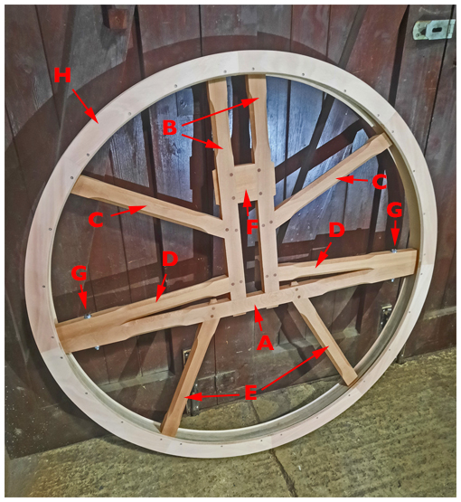
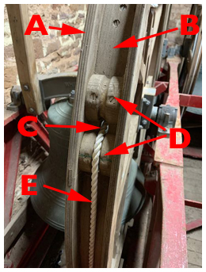
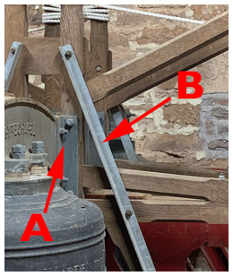
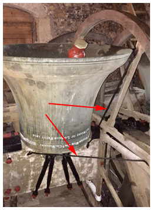

# Wheels

The basic design of bell wheels has changed little over the past 200 years. The arrangement of the spokes is both traditional and functional, although there may be some variations. A wheel is made in two parts to allow it to be fitted around the headstock. This has the bonus of making it easier to manoeuvre the parts up to the bell chamber.

## Naming of Parts

A typical wheel is constructed from eleven different components, some with different historic names. Figure 1 shows a typical wheel, viewed as it would be seen with the bell ‘down’. The names used in this chapter, with some alternatives in brackets, are identified on Figure 1 as follows:

*Figure 1: Parts of a bell wheel*

A.	Transom (Long Spoke, Transome, Long Wheel Spoke)  
B.	Main Spokes (High Rail)  
C.	Top Spokes (High Spoke)  
D.	Meeting Spokes (Meeting Rail)  
E.	Bottom Spokes (Leg Spoke)  
F.	Eye Piece  
G.	Halving Bolts  
H.	Shroud (Cheeks, Shrouding, Rave, Siding)

The bell rope enters the wheel through a Garter Hole near the Top Spoke on the ground pulley side of the wheel, the exact location depending on the position of the ground pulley. (Ground Pulleys are discussed in [Rope Routes](/docs/110-rope-route).) This is shown in detail on Figure 2 as follows:

*Figure 2: Details around the garter hole*

A.	Shroud (Cheeks, Shrouding, Rave, Siding)  
B.	Sole (Sole Plate)  
C.	Garter Hole (Fillet Hole, Gart-hole)  
D.	Wheel Bobbins (Half Bobbins)  
E.	Rope

## Construction

Traditionally, bell wheels are constructed from three different types of wood. The spokes are made from oak, the sole from ash and the shrouds from elm. Nowadays, however, shrouds are usually made from marine plywood. Shrouds were formally nailed to the sole but there is a tendency for the nails to rust and nowadays small non-ferrous or stainless-steel screws are used. Sections of shrouding are keyed together by a thin piece of wood, termed a ‘Feather’. Historically, iron feathers were used but these are subject to rusting, causing the end of the shrouding to split.

The joint between the two parts of the wheel lies between the Transome (A) and the Meeting Spokes (D) with the two parts secured by the Halving Bolts (G) – all shown on Figure 1.

As shown on Figure 2, Wheel Bobbins (D) protect the rope from wear as it emerges from the Garter Hole (C). Within the wheel, the rope is tied off around the two Main Spokes (B on Figure 1) – this figure shows how the edges of the spokes may be chamfered to avoid damage to the rope. (The tying off of a rope can just be seen on the bell in the bacground of Figure 3.) Further information is provided in [Ropes](/docs/120-ropes) and [Rope Routes](/docs/110-rope-route).

*Figure 3: Fastenings to a steel headstock (A), and an angle brace (B)*

A wheel is usually attached to a wooden [Headstock](/docs/160-headstocks) by long bolts through the main spokes and the headstock; cast iron or fabricated steel headstocks will usually have provision for a bracket to attach the wheel. An example is shown at (A) on Figure 3. That figure also shows at (B) a steel Angle Brace bolted (it may be screwed) diagonally on the inner face of the wheel to further strengthen the wheel. Wheels fitted to wooden headstocks may have Wheel Stays. These are metal rods fitted between wheel and headstock to brace the wheel (arrowed on Figure 4).

*Figure 4: Wheel stays (arrowed)*

## Checks Required


**Wheels are not for Climbing On**

Wheels are strong in terms of their designed use, but weak if subjected to a sideways force. Never use a wheel as a climbing frame when moving around the bell frame. They are expensive items to replace.


The complexity of a wheel and the materials used mean that the amount of maintenance able to be carried out by a Typical Steeple Keeper is limited. But the regular checks described below are essential to spot (and possibly rectify) problems, and to identify problems needing assistance from a Bell Hanger before they become critical.

### Wheel not running true

An initial check is to swing the bell (when down) through a small angle. Any obvious sideways movement of the rim of the wheel shows a wheel that is not running true. If this is substantial it could lead to the rope slipping wheel.

The cause may be some looseness in the fastenings, or possibly a bent wheel stay. The further checks described here may resolve the problem. If not, this is a job for a Bell Hanger.

### Damage to the wood

Any evidence of rot or beetle attack must be addressed immediately. While there are contractors who provide this service, the use of a Bell Hanger is to be preferred.

General advice is that wood should be treated with a preservative about every 10 years. Bearing in mind that the wheels need removal to do this thoroughly, the use of a Bell Hanger is preferable. It may be possible to combine this with a major overhaul.

### Loose fastenings

All fastenings on a wheel need to be checked regularly for tightness. This is particularly important for those involving wooden components, which may shrink with variations of temperature and humidity. A Typical Steeple Keeper should be competent to carry out these checks and any required tightening.


Remember that the most reliable way of checking tightness is to first loosen the nut and then re-tighten. This ensures (a) that the nut is not just rusted in position and (b) that the thread has not bottomed out.


Items to be checked are:
- The halving bolts. These are often ***[coach bolts](/docs/170-glossary/#coach-bolts)***, with the nuts underneath the transom, and easily missed.
- The fastenings between wheel and headstock, both on the wheel and headstock sides.
- Fastenings holding any reinforcing bars strengthening the wheels.
- For a wooden headstock, fastenings attaching wheel stays, if present.

It may be prudent to prepare a check list of all fastenings, to ensure none are missed. Marking checked fastenings with chalk is another possibility.

## Wear and damage

Items to be covered here are:

### Shroud

- Check for any damage. It is not unknown for contractors to cause accidental damage to a shroud while carrying out other work in the tower.
- If shrouds are nailed to the sole, check for rusting or missing nails.
- Check for splitting at joints between sections of shroud, possibly resulting from rusting of iron feathers.

A skilled woodworker may be able to rectify any problems found but, considering the complexity of a wheel, and the cost of a new one, the Steeple Keeper should consider consulting a Bell Hanger in all but very minor cases of damage.

### Sole

The sole is usually secured to the spokes by countersunk screws. These must be checked for tightness. If any part of a screw is proud it will rapidly wear the rope.

### Bobbins and garter hole

These are unlikely to cause problems but should be checked to ensure that the rope path is smooth. Careful use of sandpaper should solve any problems.

### Wheel stays

Wheel stays, as used to support the wheel with a wooden headstock, are relatively fragile and can easily be bent. In the extreme, this can cause the wheel to run untrue. If necessary, they can be carefully bent back to a straight line. If in doubt, contact a Bell Hanger.

## Image Credits

| Figure | Details | 
| :---: | --- | 
| 1 | Wheel annotated to show component parts. (Photo: Graham Clifton, Whites of Appleton) |
| 2 | Details of garter hole and bobbins. (Photo: Robin Shipp) |
| 3 | Showing (A) bracket between wheel and cast iron headstock, and (B) angle brace to strengthen the wheel. (Photo: Robin Shipp) |
| 4 | Wheel stays (arrowed) on a wooden headstock at Borden, Kent. Entry in the *Bells and Installations* round of the CCCBR Photographic Competition. Photo: Christopher J Cooper)  |

----

Version 0.1 (pre-publication), April 2022

© 2022 Central Council of Church Bell Ringers

