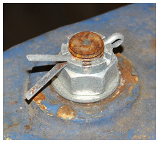

# Clappers



This chapter covers:

-   [Background](#background): The various types of clappers, how
    they are made and suspended within the bell
-   [Routine Checking](#checking): The ways in which clappers can
    be checked, both as part of a routine maintenance schedule and to
    investigate any problems
-   [Maintenance](#maintenance): The options for dealing with
    problems and the level of experience needed to carry them out
-   Final sections cover: [Other Information](#other) relevant to
    clappers and [Further Reading](#further)

## Background

A clapper assembly comprises four main components:

-   The crown staple, from which the clapper is suspended
-   The clapper ball, which strikes the bell
-   The shaft, connecting the ball to the crown staple, via the top end
    of the clapper
-   The flight, which adds mass below the ball to improve the dynamic
    behaviour of the clapper

### Types of clappers {#types}

There are three main types:

-   Traditionally, clappers were made from wrought iron. This has a low
    carbon content with slag inclusions which form a fibrous structure
    as the material is forged (or 'wrought') into a finished product.
    This material is tough, malleable, ductile, corrosion resistant and
    easily forge welded. It is an ideal material for producing a
    clapper. Unfortunately, it is now difficult to source.
-   Faced with the difficulty of obtaining wrought iron, ductile iron,
    also known as spheroidal graphitic (or 'SG') cast iron, became the
    material of use for clappers. This is iron containing a high level
    of carbon (around 3%). Unlike the more familiar form of cast iron,
    where the carbon forms inclusions in the shape of flakes, ductile
    iron includes alloying elements which result in the carbon forming
    nodular inclusions, giving a tougher material. Being cast, rather
    than forged, the shape of the casting pattern is important. Some
    early SG clappers had oversized shafts, balls and flights which
    could lead to handling and striking problems, as well as possible
    damage to the bell. It is possible to machine such clappers to a
    better profile but this must be done by a specialist. Steel clappers have been made but are not widely used.
-   Since 2005, an increasing number of bells are fitted with wooden
    shafted clappers. If well designed, these may improve the handling
    of 'awkward' bells and make it easier to raise large bells 'right'
    -- see [Wooden Shafted Clappers](#wooden). 'Composite
    clappers' are also available: these use a man-made material for the
    shaft.

### Clapper suspension -- historical {#clapper-historical}


This section describes historical clapper designs to allow a Steeple
 Keeper to recognise them. The maintenance and repair of such clappers
 is a specialist task outside the scope of this document.


Up until the mid-19th century, clappers were suspended from a U-shaped
wrought iron staple, cast into the crown of a bell during its
manufacture. Iron corrodes with time and the corroded staple expands in
the crown of the bell, generating stresses which will ultimately lead to
cracking of the bell. For this reason, cast-in crown staples must be
removed if the bell is to be retained for ringing -- see [Removal of a
cast-in crown staple](#removal).

The clapper was usually suspended from a cast-in crown staple using a
***[baldrick](/docs/170-glossary/#baldrick)*** (or 'baldric'). In the
nineteenth century, in the absence (or after the removal) of a cast-in
crown staple, a separate 'centre bolt' would be passed up through the
crown of the bell and headstock. The traditional suspension would be
made from a stirrup at the bottom of this bolt, with a baldrick or using
a wooden block arrangement -- for example, the 'Rudhall wooden top'
shown in Figure 1.

*Figure 1: Wrought iron clapper with Rudhall wooden top*

### Modern independent clapper assemblies {#modern-clapper}

In modern installations, the clapper is suspended from an independent
crown staple, with a centre bolt passing up through the crown of the
bell and the headstock. The component parts, shown in Figure 2, are:

*Figure 2: Parts of an independent crown staple*

-   A fixing nut at the top of the headstock. There are several
    possibilities for this:
    -   The most common is a castellated nut held in place with a split
        pin, shown in Figure 3. Stainless steel split pins are preferred
        to avoid corrosion and they may need to be replaced after
        removal.
    -   A plain nut with a split pin above -- the nut may work loose but
        should not come off completely.
    -   A nut plus a locknut, shown at (A) on Figure 2.
    -   A nut with a sacrificial plastic insert -- this type must be
        replaced every time the nut is removed.
    -   Proprietary locking nuts with a metallic spring section that clamps to the thread.
-   A steel washer between the nut and the top of the headstock (not included on Figure 2 but visible on Figure 3).
-   The part of the centre bolt within the headstock is often of square
    section.
-   Under the crown of the bell is the crown staple washer, made of
    leather or fibre, (B) on Figure 2. When the centre bolt nut is
    tightened, this helps to lock the crown staple in position within
    the bell. This is particularly important where the inside of the
    crown of the bell is rough -- for example where the bell has been
    quarter turned.
-   At the bottom of the crown staple is usually a clevis fitting, (C)
    on Figure 2, comprising a U-shaped yoke with a pivot pin supporting
    the clapper -- described in the following section.

*Figure 3: Castellated crown staple nut and split pin*

### Pivot pin and clapper bushes {#pivot-and-bushes}


Some designs of wooden shafted clappers have a ball bearing 
suspension. This is outside the scope of this document.


The U-shaped clevis has two holes to accommodate a pivot pin. Usually,
one hole and one end of the pin are threaded. After insertion, the
threaded end of the pin protrudes through the clevis and is secured by a
locknut -- shown at (D) on Figure 2. The other end of
the pin has a bolt head or machined flats to allow a spanner to hold the pin
while the locknut is tightened. If a bolt head
is present, care must be taken not to overtighten as this could crack a
cast staple or bend a steel one.

The top end of the clapper has a hole through which the pivot pin
passes, fitted with a replaceable bush. Various types of bushes may be
encountered:

- Traditionally, clapper bushes were made of lignum vitae. This is a dense
wood (it sinks in water) containing oils which provide some natural
lubrication. It is ideal as a bearing material and has been used for
bearings in hydro-electric plants and nuclear submarines. Unfortunately,
the source trees are now regarded as 'Near Threatened' making further
use of this material unsustainable. If worn lignum vitae bushes are
encountered, they must be replaced -- this is outside the scope of this
document.

- Clapper bushes made from lignum vitae require additional lubrication,
either by a screw cap lubricator of the 'Stauffer' type or a grease
nipple. Although more modern types of metal or plastic bushes may
require no lubrication some bell hangers still provide grease nipples or
similar, as shown at (E) on Figure 2. On balance, a method of
lubrication is preferred although the benefit of retrospective fitting
may be small.

- Modern types of clapper bush are made of:

    -   Oil impregnated sintered phosphor bronze.
    -   Nylon. Experience with a problem of swelling when damp or at
    elevated temperature means such bushes are now rarely fitted.
    Existing nylon bushes need not be replaced if performing
    satisfactorily. If necessary, the swelling problem can be rectified
    by careful reaming.
    -   TUFNOL. This is a proprietary laminated material impregnated with
    phenolic resin.
-   Bushes may be backed by a layer of rubber.

### Clapper centring pins

*Figure 4: Twiddle pin (A), and double crown staple locknut (B)*

While not strictly part of the clapper, it is appropriate to mention
these here.

Most modern rings of bells with cast iron or fabricated steel headstocks
have clapper centring pins fitted -- usually known as 'Twiddle Pins'.
There is clearance where the crown staple passes through the bottom of
the headstock and the crown of the bell: twiddle pins allow the crown
staple to be positioned in the centre of the bell. There is a twiddle
pin on either side of the headstock, one of which can be seen at (A) on
Figure 4. Each pin comprises a machine screw which locates against the
generally square section of the centre bolt. The crown staple can be
positioned by slackening one pin and tightening the other. Locknuts on
each pin allow the pins to be locked in place when the process is
complete. (Figure 4 also shows (B) another example of double locknuts on
the crown staple.)

The use of twiddle pins to correct an odd-struck bell is described in
[Odd-Struck Bells](#odd-struck).

## Checking Clappers {#checking}

This Section deals with initial and regular checks of clappers. Routine
checks and maintenance should be carried out in accordance with a
schedule - see [Maintenance Schedule](/docs/150-maintenance-schedule) - and results of all checks,
including issues raised and how they were resolved, should be recorded.

For both practical and safety reasons, the checking and any subsequent
maintenance must be carried out by at least two people, taking account
of [Health & Safety Requirements](/docs/040-health-and-safety). The checks described
here can be carried out by a Typical Steeple Keeper and helpers on the
more modern independent crown staple designs; checks on the older types
of clapper suspension may require assistance from more experienced
personnel.

The procedure for checking is as follows:

*Figure 5: Wooden shafted clapper - note bolts securing ball to shaft*


**Procedure for checking a clapper**

1. Standing in the pit, swing the clapper to check for squealing or
grinding noises. It should swing smoothly and noiselessly. If not, this
could indicate problems with the clapper bush. If the clapper has
provision for lubrication this should be used.

2. Check the clapper is swinging 'true' -- that is, the axes of rotation of
the bell and the clapper are parallel. This can be checked by loosely
holding the clapper vertical while a helper swings the bell through
a small angle. If the clapper is not true it will move slightly sideways
as the bell swings. Correction of this problem is described in [Clapper
not swinging true](#clapper-not-true).

3. If this is a first check, assess the extent of the clapper impact area
on the inside of the bell. If elongated this indicates wear of the
clapper bush.

4. If the bell has a wooden clapper, this is a good time to check the
tightness of the bolts securing the shaft to the clapper ball (see Figure 5) and the
top fitting. For all clapper types, also check the
locknut on the pivot pin. These fittings are subject to vibration,
especially if the bush is worn, and it is not unknown for the pivot pin
to work its way out and lead to ejection of the clapper. The
consequences of this are similar to those of a [broken
clapper](#breakage).

5. Check the movement of the clapper by attempting to lift the clapper
vertically while a helper holds the crown staple nut lightly (if
twiddle pins are present, slacken one of them first). On a
well-maintained bell, there should be no vertical movement of the crown
staple nut. **When finished, remember to re-tighten the twiddle pin.**

6. There are two main reasons why movement might occur:

    -  The nut may have worked loose. This is unlikely with a castellated
    nut and split pin or a proprietary type of locknut but might occur
    with other types of nuts. The corrective action is described in
    [Correcting loose crown staple nut](#loose-crown-staple).

    -  The crown staple washer may be damaged or have become compressed.



With the crown staple tight on the crown of the bell, there may still be
some small vertical movement arising from play in the clapper bush. This
can be investigated further by the sideways movement of the clapper --
sometimes termed "clapper roll". This is a sensitive measurement as a
small movement in the bush is magnified by the length of the clapper.
Clapper roll is measured most easily by standing in front of the bell
with the clapper pulled to touch the rim. The total extent (left to
right) of sideways movement can then be measured. The amount of roll
should be checked and recorded on each occasion to provide a history of
bush wear and to give warning of the need for re-bushing. As a guide,
clapper roll over 20mm is warning of a need to plan for re-bushing and
over 50mm requires immediate attention. A sudden large increase in
clapper roll may indicate breakage of the pivot pin.


If the bells have not been inspected for a long time, wear of the bush will also be revealed by an elongated impact area on the bell.


It will be necessary to remove the clapper to investigate (a) noise from
the swinging clapper, (b) excessive clapper roll, or (c) possible damage
to the crown staple washer or pivot pin -- clapper removal is described
in [Removal and replacement of a clapper](#removal-and-replacement).

## Maintenance

### Removal of a cast-in crown staple {#removal}

Removal of a cast-in crown staple must be carried out by a professional
Bell Hanger, commonly within their workshop. **Note that this work will
require a faculty**.

### Clapper not swinging true {#clapper-not-true}


When working under small bells it may be necessary to remove the 
slider (if present) to provide better access. You **MUST** check it 
has been replaced correctly when the work is complete.


Correction of a clapper which is not swinging true is within the capability of a Typical Steeple Keeper.



**Procedure for correcting a clapper not swinging true**

1.  Slacken off one twiddle pin if present.
2.  Helper **just** slackens the crown staple nut.
3.  Steeple Keeper loosely holds the clapper vertical and checks for sideways
    movement as the helper swings the bell through a small angle.
4.  The Steeple Keeper twists the clapper to correct the swing and repeats
    step 3 until satisfied that the clapper is swinging true.
5.  Steeple Keeper holds the clapper in the correct position against the edge
    of the bell while the helper tightens the crown staple nut and,
    if fitted, the twiddle pin.
6.  Repeat step 3 to check that the clapper is still swinging true --
    over-enthusiastic re-tightening of the crown staple nut may rotate
    the crown staple.



Record a note to repeat the check at the next maintenance session. The
clapper will need removal for further investigation if the problem
recurs.

### Correcting loose crown staple nut {#loose-crown-staple}

As in replacement of the clapper described below.

### Removal and replacement of a clapper {#removal-and-replacement}


Using local effort to remove and replace a clapper is valuable, since 
it saves a bell hanger the time and expense of travel to do this small 
part of the work.


Removal and replacement of a clapper is within the capability of a
Typical Steeple Keeper, even if rectification of any problems requires
specialist services. 



**Procedure for removal of a clapper**

1.  Remove the split pin if present. Slightly loosen the crown staple
    nut, ideally using the correct size spanner, although a large
    adjustable spanner is a possible alternative. This may require some
    effort.
2.  If twiddle pins are present, slacken one. Alternatively, slacken
    both by the same number of turns.
3.  Using tape or a marker pen, mark the ground pulley side of the
    clapper and the crown staple. This is to ensure that the clapper is
    replaced in the original orientation.
4.  A helper stands in the pit ready to support the clapper while
    the Steeple Keeper removes the crown staple nut. The Steeple Keeper must warn
    the helper just before the nut comes off the thread. The nut and
    washer are replaced for safe keeping on the crown staple after
    removal.



With the assembly removed, any problems with a worn bush, failure of a
pivot pin or a damaged crown staple washer will usually be obvious. Any
problems can be rectified either by a local engineering specialist or a
Bell Hanger. If this involves disassembly of the clapper, the contractor
must be required to replace it in the original orientation, using the
marks made on the clapper and crown staple in item 3 above.

Note that the traditional leather or fibre washers may compress
gradually and be more easily damaged by movement. Harder materials are
available and advice on this should be sought from a Bell Hanger.

Replacement of the clapper follows the reverse procedure, ensuring that:

- The clapper is replaced in the original orientation and is swinging
    true -- see [Clapper not swinging true](#clapper-not-true).
- The twiddle pin or pins, if present, is/are tightened. This is done
    with the crown staple nut **just** tight ("nipped up" seems to be
    the technical term).
- The crown staple nut is tightened. A rule of thumb is to use
    reasonable force applied to a 10 inch (25cm) spanner.
- A final check is carried out to ensure the clapper is swinging true.



The precautions described above to replace the clapper in the same
orientation should ensure that the clapper will not become odd-struck
(assuming it was not originally odd-struck). If the clapper has not been
marked or reassembled incorrectly it will be necessary to check the
odd-struckness and correct as necessary -- see [Odd-Struck
Bells](#odd-struck).



Finally, details of the work carried out are recorded for future
reference.

## Other Information {#other}

### Odd-struck bells {#odd-struck}

Ideally, the time it takes for a bell to strike after being pulled off
at handstroke should be equal to the time at backstroke. Many ringers
will have visited towers where they are warned that a certain bell is "a
bit slow at handstroke" or something similar. But this should not be the
case for a modern bell with the clapper hanging in the centre of the
bell at rest.


We are assuming here that all the checks and maintenance described above have been carried out. This should have eliminated problems caused by clappers not running freely, worn bushes, loose crown staples and so on. All of these could result in unpredictable odd-struckness. But, as a responsible Steeple Keeper, you will have already ruled out all of these.


A bell that is noticeably odd-struck and has twiddle pins can be
corrected as follows:



**Procedure for correcting odd-struckness**

1.  With the bell down, pull up the rope and secure it to take the
    weight of the rope off the wheel. The bell should now be at bottom
    dead centre of its rotation. If possible, check this with a straight
    edge and a spirit level across the mouth of the bell. (A bell on
    plain bearings may need nudging for it to settle at bottom dead
    centre.)
2.  **Slightly** loosen the crown staple nut.
3.  Standing facing the bell, touch the end of a tape measure against
    the striking surface on the clapper ball (taking care not to move
    the clapper) and read the measurement to the lip of the bell.
4.  Repeat this on the opposite side (it helps to have one person on
    each side).
5.  If the readings are different, slacken one twiddle pin and tighten
    the other.
6.  Repeat steps 3 to 5 until the two measurements are equal, ideally to
    within 1mm.
7.  Re-tighten the crown staple nut and twiddle pins, and re-instate the bell rope.



If twiddle pins are not present, the recommendation is to place a
tapered washer (or a half-washer) under the crown of the bell. Advice on
this should be sought from a specialist.

Electronic devices are available for measuring odd-struckness -- as
described in [Odd-struckness and swing periods](#odd). It may be possible to
find someone able to offer this as a service -- perhaps in your local
Guild or Association. Such a device can also offer useful data on the
swing periods of bells and the comparison between all bells in the ring
-- see also in [Odd-struckness and swing periods](#odd). While outside the scope
of this document, this may be worth investigating as a way of dealing
with problems in striking for some rings of bells.

### Clapper breakage {#breakage}

*Figure 6: SG cast iron clapper broken at the top end*

The consequences of a broken clapper (Figure 6) can be serious, with the
flying clapper causing expensive damage - maybe even breaking another
bell. In the event of breakage, the steeple keeper **must** check all
parts of the installation for any consequential damage.

Failures such as that shown in Figure 6 usually occur in SG clappers and
result from a fatigue crack initiated from a pre-existing defect,
leading to failure when the crack reaches a critical size. This type of
crack is almost impossible to detect before failure without the use of specialised
equipment and certainly not with the clapper in place within the bell.

Broken clappers, either SG or wrought iron, cannot be repaired by
electric welding. This would require specialist welding techniques and
is used only for cosmetic welds, not those subject to high stresses. For
an SG clapper, the answer is a new clapper. Wrought iron clappers can be
repaired by forge welding -- in fact, many wrought iron clappers are
made in two parts which are then forge welded to the correct length. But
this work must be carried out by a specialist.


Another possible cause of clapper failure is the pivot pin working 
loose and eventually falling out. This is something which should be 
detectable at an early stage and rectified during regular checks.


In summary, any repairs or replacements for clappers must be carried out
by a Bell Hanger. A Typical Steeple Keeper can play a part by
removing the remains of the clapper and by installing the new or
repaired one.

### Worn clapper ball {#worn-ball}

Wear on the striking face of the clapper ball should be checked during
routine maintenance. If a substantial flat surface has developed this is
a job for a Bell Hanger, although the Steeple Keeper can assist by
removing and replacing the clapper. The Bell Hanger may be able to twist
and re-forge the shaft of a wrought iron clapper to present a new
striking face.

### Bell going up wrong {#going-up-wrong}

Some bells, particularly those over 20 to 25 cwt, are prone to going up
'wrong'. That is, the clapper is on the higher (wrong) side of the bell
when it is set at handstroke after raising. For some bells, it may be
difficult to set the bell when this occurs. This depends on the design
of bell and clapper -- more specifically, on (a) the distance between
the two axes of rotation of bell and clapper, and (b) the low amplitude
swing periods of the bell and clapper. As a rough guide, the low
amplitude swing period of the clapper should be at least 90% that of the
bell.

Rectification is a job for specialists. Replacement with a wooden
shafted clapper may help.

## Further Reading {#further}

### Wooden shafted clappers {#wooden}

Bernard Taylor provides a history of the development of wooden shafted
clappers in: "Wheeler's Wooden Wallopers". *The Ringing World* 2020
(5721): 1258-1261. Several other suppliers now provide their own
designs.

### Odd-struckness and swing periods {#odd}

David Bagley describes a meter for measuring odd-struckness in
"Oddstruckness -- What it is and how to measure it", *The Ringing World*
2019 (5653): 840-841.

Bernard Taylor describes work on swing periods and the matching of bells
within a ring in "Creating a well-balanced ring at Worcester", *The
Ringing World* 2019 (5686): 388-391, (5694): 582-585 and (5679):
652-653.

## Image Credits

| Figure | Details | 
| :---: | --- | 
| Title Picture | Bell and clapper in motion at Worcester Cathedral. Cropped from an entry in the *Bells and Installations* round of the Central Council photographic competition. (Photo: Phillip George) |
| 1 | Rudhall 'Wooden Top' clapper removed from 4th bell at Thornbury, South Glos, during rehanging in 1996. (Photo: Robin Shipp) |
| 2 | Clapper from Palmer, Houston, showing (A) double locknut, (B) crown staple washer, (C) clevis, (D) pivot pin locknut and (E) nipple for lubrication of the bush. (Photo: Allen Nunley) |
| 3 | Castellated nut and split pin on seventh bell at Chipping Sodbury. (Photo: Robin Shipp) |
| 4 | Headstock of Tenor bell at Thornbury, South Glos, showing (A) 'Twiddle Pin' and (B) crown staple secured by a nut and locknut. (Photo: Robin Shipp) |
| 5 | Wooden shafted clapper installed by Whites of Appleton on Tenor bell at Thornbury, South Glos. Note the bolts securing the clapper ball to the shaft (other designs may vary). (Photo: Robin Shipp) |
| 6 | SG clapper broken at the top end. (Photo: Dave Clark) |

-----

Version 0.1 (pre-publication), April 2022

© 2022 Central Council of Church Bell Ringers
