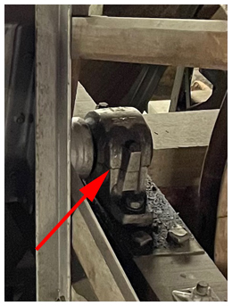
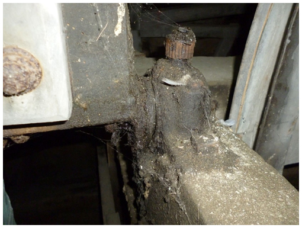
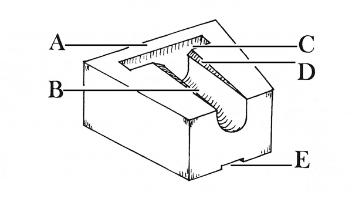
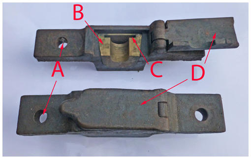
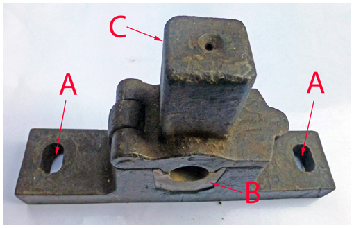

# Bearings

The main bearings are critical items: in any installation, they support the large mass of metal swinging through a full circle and their condition is fundamental to the ‘go’ of the bell. You may encounter the two types of bearing – plain bearings and ball bearings. We will describe both, but a Typical Steeple Keeper’s main task will be the important role of carrying out the checks described here. This will help identify any problems before they reach a critical stage.



A Typical Steeple Keeper can only carry out basic maintenance on bearings: for example, lubrication of plain bearings. Major jobs will usually require the lifting of a bell, even by a small amount, and this is a job for Bell Hangers, who carry the necessary insurances and requirements of Health & Safety regulations. Also, within the jurisdiction of the Church of England, there will be a legal requirement to obtain a faculty for such work. Further details are given in [Formal Requirements](/docs/020-permissions/), [Faculty Jurisdiction Rules](/docs/030-faculty-rules/) and [Health & Safety](/docs/040-health-and-safety/). 



## Ball Bearings

### Description

Ball bearings started to be fitted to bells only in the early 1920s but their use since then is almost universal, so these are the ones you are most likely to experience.

*Figure 1: Ball bearing - the split for assembly is arrowed*

A ball bearing (Figure 1) is a sealed unit that should require no regular maintenance. The bearing consists of one (or possibly two) rings of hardened steel balls running between two hardened steel tracks. The inner ring is mounted on the ***[gudgeon](/docs/170-glossary/#gudgeons)*** and the outer on the bearing housing, mounted on the frame. On assembly, the bearings are filled with grease which is retained by seals. The grease provides some lubrication to prevent ***[fretting](/docs/170-glossary/#fretting)*** between the balls and the track, but its main use is to protect the components from rusting.

Designs vary, but the type of bearing shown in Figure 1 is split for assembly along the line arrowed. Do not try to separate the two halves during routine checks.

The ball bearings used for bell hanging are self-aligning, allowing for small movements of the bell frame – particularly important for wooden frames. Lateral movement, resulting from small movements between the two side frames, is accommodated by a small amount of lateral travel (often termed ‘end float’) on one bearing, usually the one on the wheel side. 

In many engineering applications, ball bearings provide prolonged satisfactory operation. But the alternating direction of rotation of the bell when ringing is not ideal, and neither are impacts on the bell from clock or chiming hammers. Impacts from chiming hammers is particularly harmful, as the film of grease may not be replenished when the bell is stationary, leading to metal-to-metal contact between the balls and the track.

### Regular checks and maintenance

Unless you suspect a problem with ball bearings (see [Problems with Bearings](#problems-with-bearings)), the only checks you should undertake are:


1.	Check the tightness of the bolts holding the bearing to the frame.
2.	Check for leakage of grease from the end seals. 
3.	Check clearances at either side – a bell can ‘travel’ sideways slightly, especially when subjected to a heavy clock hammer. This is unusual but should be checked.


These checks can be undertaken by a Typical Steeple Keeper; but points 2 and 3 can only be rectified by a Bell Hanger.

Some older ball bearings may have a grease nipple. This does NOT mean they require the grease to be ‘topped up’ regularly – that is a certain way of damaging the seals. Do not use a grease gun on these. The results of over greasing can be seen in Figure 2.

*Figure 2: The unfortunate effect of forcing grease into a ball bearing*

As noted above, ball bearings are not working in an ideal regime. Even if no problems are experienced, it may be prudent to seek advice from a Bell Hanger on ball bearings more than 10 to 15 years old, especially if the bells are heavily used.

## Plain Bearings

### Description

A plain bearing (“journal bearing” in engineering parlance) comprises a shaft rotating within a journal. The shaft and journal are made of different materials and the bearing requires lubrication – wear is avoided by the shaft floating on a thin film of oil as it rotates.
For a bell, the ‘shaft’ is the steel gudgeon attached to the headstock (the moving part) and the ‘journal’ is a ‘bearing brass’ (sometimes made of bronze) attached to the bell frame (the fixed part). A typical bearing brass, of a type used since the Middle Ages, is shown in Figure 3. 

*Figure 3: Parts of a typical plain bearing brass*

The bearing brass (A) is wedge shaped. Traditionally it was fitted directly into an oak frame; more recently it would be fitted into a metal bedplate attached to the frame. The gudgeon revolves in the groove (B), with a reservoir for the oil (C). The top edges of the groove (D) may be chamfered to conduct surplus oil back to the reservoir. There is a slot (E) for inserting a chisel to remove the bearing. This is a task for a bell hanger, not a Steeple Keeper.

*Figure 4: Parts of a plain bearing assembly*

Figure 4 shows bearings on two bedplates which would be attached to the frame by hold down bolts through the holes at (A). The bearing brass (B) is inserted into the bedplate and the slot for the oil reservoir can be seen at (C). In this design, a felt pad would be placed on top of the gudgeon before the lid (D) is closed. This helps to help distribute the oil around the gudgeon. Note that failure to close the lid leads to loss of lubricant and can cause a bearing to seize.

*Figure 5: Alternative plain bearing assembly with oil reservoir*

Figure 5 shows an alternative design. Again, the holes for hold down bolts and the bearing brass can be seen at A and B, respectively. In this design, the oil is supplied from above in the reservoir (C), which contains a felt wick. The oil can be topped up through the small hole in the top of the reservoir.

In most engineering applications, journal bearings will operate with a steady rotation maintaining the oil film. In full circle ringing, however, the bell comes to rest with mouth upwards then turns in the opposite direction. At this point the oil film compresses and this has a very marginal braking effect on the bell. Some ringers feel that this helps to control the bell near the balance. This may be a myth: you need to make up your own mind.

Most plain bearings allow a small amount of end float, but they are not self-aligning. This means that the gudgeons must be accurately aligned on installation. This presents a problem for wooden frames which may distort with time. This can lead to ‘pinching’ resulting in sudden dropping of the bell. This should not be a problem for plain bearings correctly mounted on metal frames.

### Regular checks and maintenance


This describes the work which should be carried out regularly by a Typical Steeple Keeper. Dealing with more fundamental problems is described below in [Problems with Bearings](#problems-with-bearings).


The main routine task for plain bearings is lubrication. Traditionally, castor oil was used – more specifically the ‘veterinary grade’. This may be difficult to procure, and an alternative is the oil developed to lubricate the chain on chainsaws. This contains a component to enhance the ‘anti-fling’ property needed for chainsaws and this may help to maintain the lubrication of the bearing. During lubrication, it is important to keep the area around the bearing clean to avoid ingress of any abrasive particles, such as dust and grit from tower masonry.

Do not use grease as a lubricant. It forms an arch over the revolving part and never reaches where it is needed.

The recommendation is to lubricate little and often, preferably before each ringing session. A Steeple Keeper may find this unduly onerous: this is probably the major objection to the use of plain bearings.

During a routine inspection, the Steeple Keeper should carry out two other checks:


1.	With the bearing cap open, check for any scoring on the gudgeon. This may indicate abrasive particles in the bearing. If it becomes severe it may be necessary to clean the bearing. This requires lifting the bell which, as noted earlier, is a job for a Bell Hanger. 
2.	For a wooden frame, check that frame movement or damage has not caused the bearing to move. Again, if this is the case, it is a job for a Bell Hanger.


## Problems with Bearings


**DANGER**: Extreme care must be exercised when carrying out the tests described in this section and two people (at least) must be present. Even when swinging through a small angle a bell can cause considerable damage if clothing or body parts become trapped. 


Even if no obvious problems have been detected, the ‘go’ of one or more bells may have become worse, on either plain or ball bearings. Ultimately, this is a problem for a Bell Hanger, but a Typical Steeple Keeper can get some information by listening carefully as the bell is swung by a **SMALL** amount while **DOWN**. Any squeaking, grinding or rumbling may indicate a problem and will signal the need for an expert opinion.

For this to work, other extraneous noise must be minimised:

- The clapper should be tied to remove any noise from the clapper bush.
- The rope should be tied clear to remove noise from pulleys, loose bosses and rope chutes, and the bell swung by hand.

A further test would be to swing several bells by the same small amount and check the times taken for the bell to come to rest. A time much shorter than for bells of similar weight could indicate a bearing problem.

## A Final Warning

To reiterate what we have said above: a Steeple Keeper must **NOT** attempt to dismantle bearings, plain or ball, and must not undertake any work which involves lifting a bell, even by levering it up a small amount.

## Image Credits

| Figure | Details | 
| :---: | --- | 
| 1 | Ball bearing on the Tenor bell at Gloucester Cathedral. (Photo: James Joynson) |
| 2 | The unfortunate result of forcing grease into a ball bearing. (Photo: Malcolm Taylor) |
| 3 | Component parts of a plain bearing brass. From "A schedule of Regular Maintenance”, Central Council publication, 1991. (Drawing © Alan Frost) |
| 4 | Plain bearing assembly showing (A) holes for hold-down bolts, (B) bearing brass, (C) oil reservoir slot, (D) lid. (Photo: Alison Hodge) |
| 5 | Plain bearing showing (A) holes for hold-down bolts, (B) bearing brass, (C) oil reservoir. (Photo: Alison Hodge) |

----

Version 0.1 (pre-publication), April 2022

© 2022 Central Council of Church Bell Ringers

