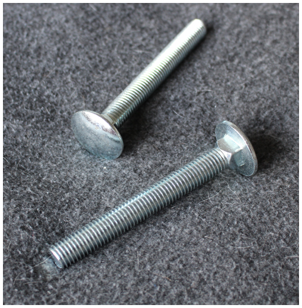
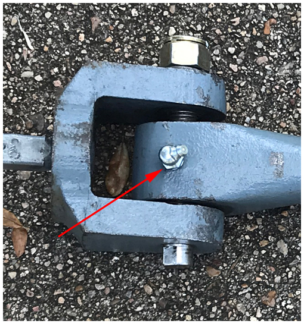

# Glossary

As with any techical subject, bell ringing and bell hanging has, over the years, developed specialist terms some of which are unique to ringing and others which have particular meaning when applied to ringing. Some other technical terms may not be familiar to ringers. We hope to have included all of these here. They are linked from the text in the various chapters.

## Argent

The central boss on the crown of older bells, around which the canons are grouped. These are used to attach the bell to the headstock.

## Baldrick

A U-shaped metal strap with leather lining from which clappers used to be suspended. The name originates from a belt worn over one shoulder to support a sword or bugle and is sometimes referred to as a 'baldric'.

## Canons

(Sometimes 'Cannons'). The loops cast onto the crown of older bells, by which the bells is suspended from the headstock.

## Clapper

The component suspended inside a bell which, when the bell is swung, strikes the bell to produce the note. See [Clappers](/docs/090-clappers).

## Coach Bolts

Coach bolts (sometimes referred to as 'Carriage Bolts') are used in a bell installation for bolting a wooden component to either a metal or wooden component - most often to bolt a stay onto a headstock. The square section under the domed head bites into the wood, securing the head while the nut is tightened.

## Fretting

Fretting refers to wear damage of loaded surfaces in contact with little or no lubrication, encountering movement tangential to the surface. Fretting is caused by adhesion of surface asperities, which are then broken by the small movement.

## Grease Nipple

Designs vary, but this is a device for lubricating a component with moving parts. A grease gun locks on to the nipple and grease can be pumped in. The picture above is of a grease nipple (arrowed) on a clapper clevis, which allows lubrication of the clapper bush -- see [Clappers](/docs/090-clappers). Grease nipples may be found on ball bearing housings: these are used to charge the bearing with grease on manufacture and should not be pumped with grease during use. This is a sure way of damaging the seals on the bearing -- see [Bearings](/docs/100-bearings).

## Gudgeons

The steel shafts fixed to the headstock that form the axle about which the bell rotates.

## Headstock

A wood or metal beam supporting the bell. The wheel, stay and gudgeons are attached to the headstock.

## Psittacosis

Psittacosis is an infection of birds caused by the bacterium Chlamydia psittaci. Birds can transmit C. psittaci to humans; the resulting infection is also known as psittacosis or ornithosis.

## Wheel

A circular wooden component attached to the headstock by which the rope is attached to the bell, permitting it to be rung full circle. See [Wheels](/docs/070-wheels).

## Image Credits

| Glossary Item | Details | 
| :--- | --- | 
| Coach Bolts| Photo: Robin Shipp |
| Grease Nipple | Enlarged from photo by Allen Nunley |

-----

Version 0.1 (pre-publication), March 2022

© 2022 Central Council of Church Bell Ringers